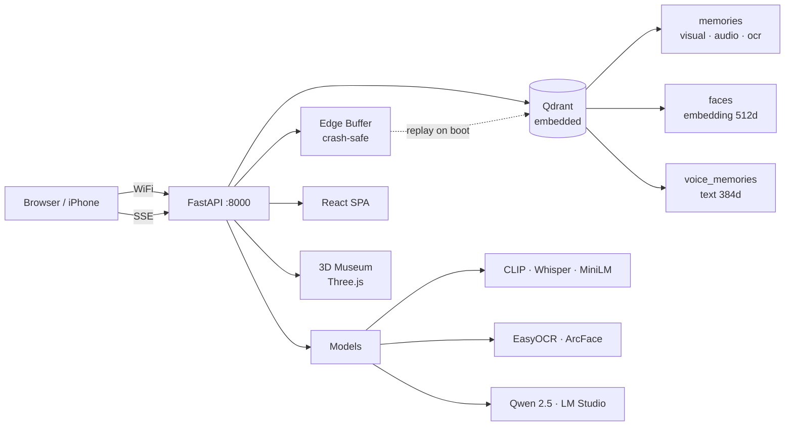

<div align="center">


<h1>Échos</h1>

<p>
  <a href="https://opensource.org/licenses/MIT"></a>
  <a href="#"></a>
  <a href="#"></a>
  <a href="https://discord.gg/qdrant"></a>
</p>

<p>
  <b>Search every memory on your phone, in one place.</b><br>
  Photos, videos, screenshots, voice memos &mdash; all local, all private.
</p>

</div>

---



---

## Features

- **Multi-modal search** &mdash; one query across photos, videos, voice memos, screenshots
- **3D Memory Museum** &mdash; walk through themed rooms (HDBSCAN + LLM-named clusters)
- **Face detection & clustering** &mdash; auto-grouped, labelable, deletable
- **Voice assistant** &mdash; push-to-talk, local Whisper STT, Qwen synthesis, offline TTS
- **Qdrant Edge buffer** &mdash; crash-safe write layer replays leftover points on boot
- **Library browse** &mdash; scroll every memory chronologically
- **People view** &mdash; browse by face clusters
- **Direct upload** &mdash; from any device on local WiFi, parallel with cancel
- **Nothing leaves your device** &mdash; embedded Qdrant, all models local

---

## Qdrant Collections

| Collection | Vectors | Purpose |
|-----------|---------|---------|
| `memories` | `visual` (512d CLIP), `audio_transcript` (384d), `ocr_text` (384d) | All indexed memories |
| `faces` | `embedding` (512d ArcFace) | Face detection + clustering |
| `voice_memories` | `text` (384d MiniLM) | Past Q&A pairs for conversational context |

Search fans out into all spaces in parallel; results merge via cosine-weighted fusion.

---

## Qdrant Edge

`edge_buffer.py` wraps `qdrant-edge-py` as a crash-safe write buffer. On server start, any leftover points from an interrupted indexing session are replayed into the main `memories` collection, then the Edge shard is cleared. This guarantees no memory is lost if the process dies mid-index. The Edge shard lives at `qdrant_storage/edge_buffer/` alongside the embedded Qdrant store.

---

## Setup

Requires Python 3.11+, [`uv`](https://docs.astral.sh/uv/), `ffmpeg` on PATH.

```powershell
uv venv --python 3.11
uv sync
uv run python main.py
```

Open `http://localhost:8000` &mdash; the React app loads automatically.

### LM Studio (voice assistant + cluster names)

1. Install [LM Studio](https://lmstudio.ai/)
2. Download `Qwen 2.5 3B Instruct` (Q4_K_M) &mdash; fits in 4GB VRAM
3. Start the local server (port 1234)
4. Voice assistant and museum room naming use the local LLM

### Groq API (optional fallback)

Set `GROQ_API_KEY` in `.env`. Local LLM is tried first; Groq is the fallback.

---

## Run on iPhone over WiFi

1. PC and iPhone on same WiFi
2. Find PC IP: `ipconfig` &rarr; IPv4 Address
3. Open `http://<PC_IP>:8000` in Safari
4. Add to Home Screen for app-like experience

---

## Frontend

```powershell
cd echoes-front
npm install
npm run build       # production build &rarr; dist/
npm run dev         # dev server with HMR on :5173
```

Stack: Vite &middot; React 19 &middot; TypeScript &middot; TailwindCSS &middot; React Query &middot; wouter

---

## Supported file types

| Modality | Extensions | Indexed via |
|----------|-----------|-------------|
| Photo | `.jpg .jpeg .png .webp .bmp .heic` | CLIP + EasyOCR |
| Screenshot | same, filename `screenshot_*` | CLIP + EasyOCR (mandatory) |
| Voice memo | `.m4a .mp3 .wav .ogg .flac` | Whisper tiny &rarr; MiniLM |
| Video | `.mp4 .mov .mkv .webm .avi` | CLIP keyframe mean + Whisper |

---

## Caveats

- **MiniLM short-text retrieval** boosted by per-space cosine floor (0.30) and weight (1.6&times;) for `audio_transcript`.
- **Sentence-transformers** pinned to 3.3.1 (5.x has broken pooling for `all-MiniLM-L6-v2`).
- **Cold start** downloads ~1.5 GB of model weights. Run once with internet, then `HF_HUB_OFFLINE=1 TRANSFORMERS_OFFLINE=1` to go fully offline.
- **EXIF dates** extracted where available; filename dates used as fallback. Files without either use file mtime.

---

**Échos** (French: "echoes") &mdash; memories that come back to you.
