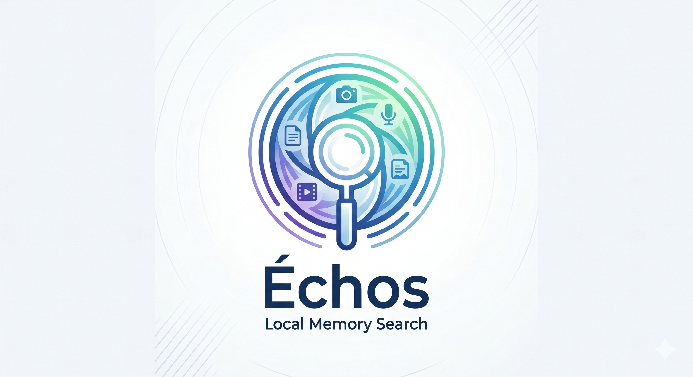
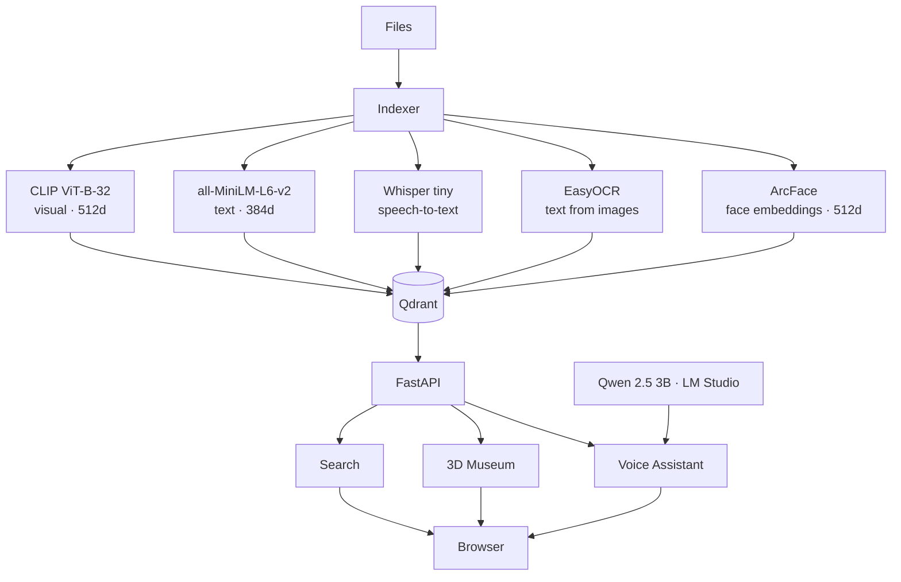
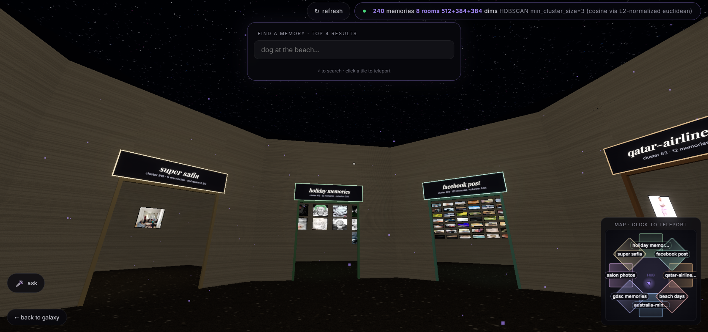
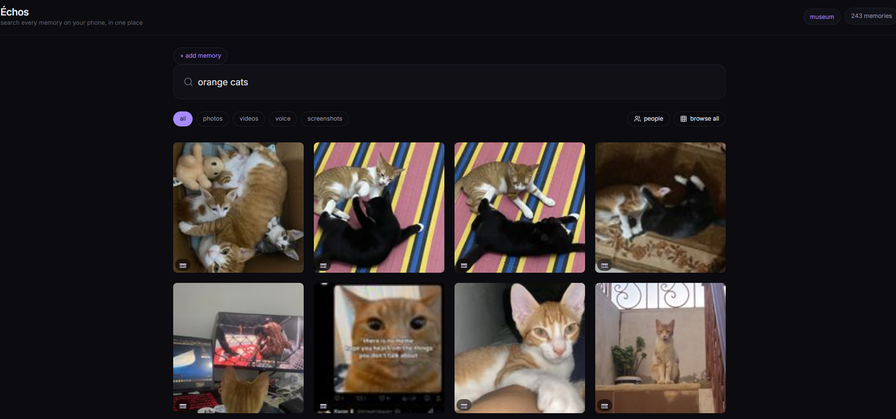
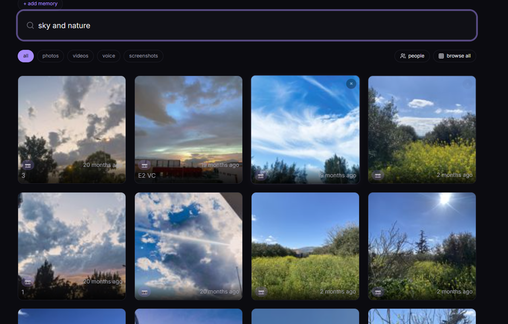
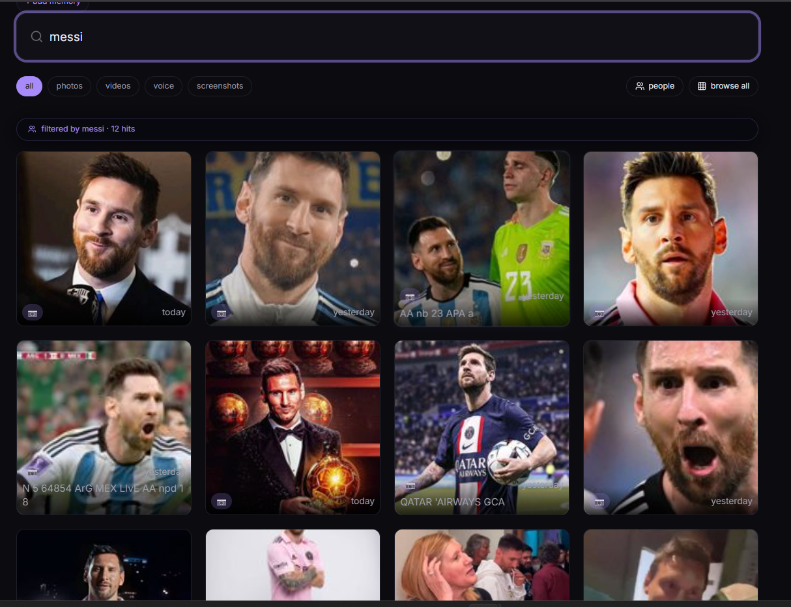
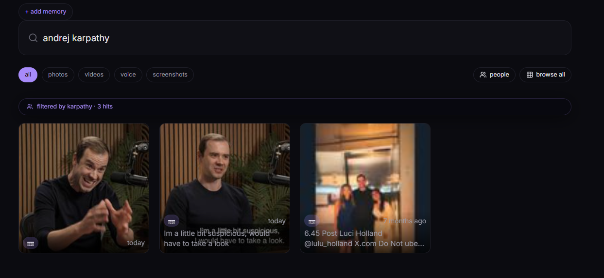
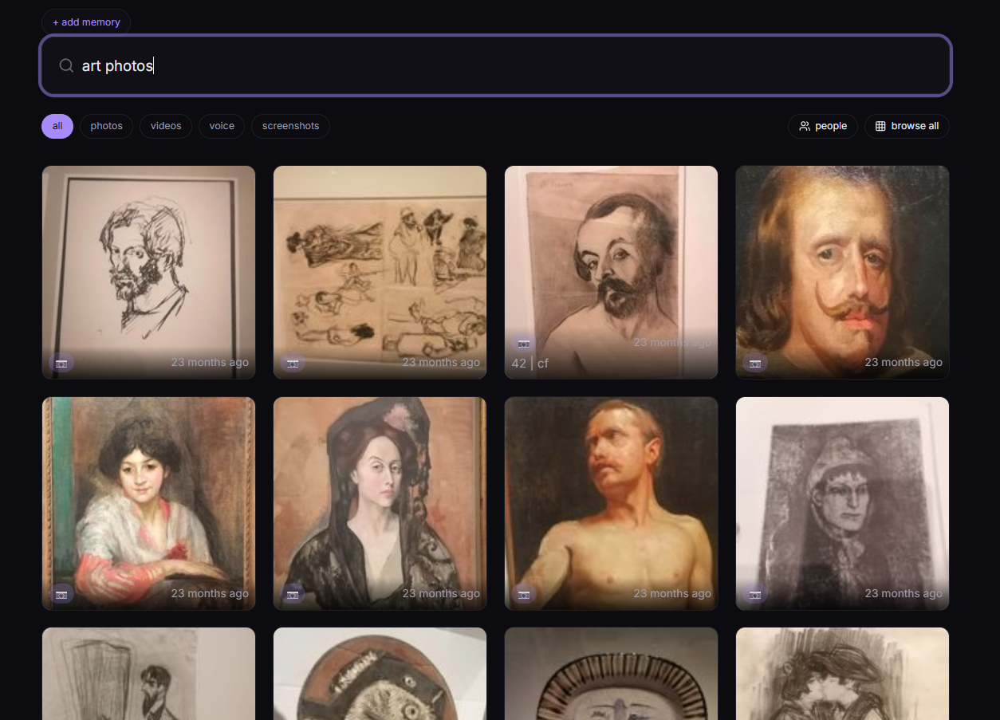

<div align="center">

<h1>Échos</h1>
<h3>powered by </h3>


<p>
  <a href="https://opensource.org/licenses/MIT"></a>
  <a href="#"></a>
  <a href="#"></a>
  <a href="https://discord.gg/qdrant"></a>
</p>

<p>
  <b>Search every memory on your phone, in one place.</b><br>
  Photos, videos, screenshots, voice memos - all local, all private.
</p>

</div>

---



## Demo Video
[Watch on YouTube](https://www.youtube.com/watch?v=05BE_IZWjEk)


---

## Features

- **Multi-modal search** - one query across photos, videos, voice memos, screenshots
- **3D Memory Museum** - walk through themed rooms (HDBSCAN + LLM-named clusters)
- **Face detection & clustering** - auto-grouped, labelable, deletable
- **Voice assistant** - push-to-talk, local Whisper STT, Qwen synthesis, offline TTS
- **Qdrant Edge buffer** - crash-safe write layer replays leftover points on boot
- **Library browse** - scroll every memory chronologically
- **People view** - browse by face clusters
- **Direct upload** - from any device on local WiFi, parallel with cancel
- **Nothing leaves your device** - embedded Qdrant, all models local

---

## Qdrant Collections

| Collection | Vectors | Purpose |
|-----------|---------|---------|
| `memories` | `visual` (512d CLIP), `audio_transcript` (384d), `ocr_text` (384d) | All indexed memories |
| `faces` | `embedding` (512d ArcFace) | Face detection + clustering |
| `voice_memories` | `text` (384d MiniLM) | Past Q&A pairs for conversational context |

Search fans out into all spaces in parallel; results merge via cosine-weighted fusion.

### How search works

Each query is embedded into all three spaces with CLIP (visual) and MiniLM (text/OCR). Results merge via **cosine-weighted fusion**: every hit gets a weighted average of its raw cosine similarities across matched spaces. Items carry only the spaces they were indexed with - a photo without a transcript isn't penalised. Multi-modal items get a tiny bonus (+0.02 per extra space) to break ties in favour of richer matches. Per-space cosine floors and weights let voice memos compete fairly (they only exist in one space).

### Museum clustering



The 3D museum uses **HDBSCAN** applied to the 512d CLIP visual embeddings. Similar memories group into clusters, each becoming a themed room. Within each room, paintings are positioned by **cosine similarity to the cluster centroid** - the most representative memory at the center, others radiating outward by relevance and recency. Room names are generated by a local LLM (Qwen 2.5 3B via LM Studio), with a bigram fallback and a final "Cluster #N" safety net.

### Face detection pipeline

Faces are detected with **YOLO** and embedded with **ArcFace** (insightface, 512d). Each face gets a quality score combining sharpness, box size, and detection confidence. **HDBSCAN** clusters faces into identity groups. When a person is named, that label feeds back into search; Qdrant filters by their face cluster, boosting results where they appear. Labels survive full re-scans via memory-ID overlap matching.

### Voice assistant + memory

The push-to-talk assistant uses **local Whisper** for speech-to-text, embeds the question with MiniLM, searches both `memories` and `voice_memories` collections, then synthesizes a natural answer via the local LLM. The Q&A pair is stored in `voice_memories` so future questions have conversational context; the assistant remembers what you asked before. Browser TTS speaks the answer back, fully offline.

---

## Qdrant Edge

`edge_buffer.py` wraps `qdrant-edge-py` as a crash-safe write buffer. On server start, any leftover points from an interrupted indexing session are replayed into the main `memories` collection, then the Edge shard is cleared. This guarantees no memory is lost if the process dies mid-index. The Edge shard lives at `qdrant_storage/edge_buffer/` alongside the embedded Qdrant store.


---
## Demo Queries

A single search box across photos, screenshots, videos, and voice memos, all matched via Qdrant vector search.

| Query | What surfaces | Screenshot |
|-------|--------------|------------|
| `orange cats` | Cat photos matched via CLIP visual space |  |
| `sky and nature` | Landscapes and nature photography |  |
| `messi` | Football photos found by visual similarity |  |
| `andrej karpathy` | Relevant screenshots and photos |  |
| `art photos` | Matches visual style, not just keywords |  |


---

## Setup

Requires Python 3.11+, [`uv`](https://docs.astral.sh/uv/), `ffmpeg` on PATH.

```powershell
uv venv --python 3.11
uv sync
uv run python main.py
```

Open `http://localhost:8000` - the React app loads automatically.

### LM Studio (voice assistant + cluster names)

1. Install [LM Studio](https://lmstudio.ai/)
2. Download `Qwen 2.5 3B Instruct` (Q4_K_M); fits in 4GB VRAM
3. Start the local server (port 1234)
4. Voice assistant and museum room naming use the local LLM

---

## Run on iPhone over WiFi

1. PC and iPhone on same WiFi
2. Find PC IP: `ipconfig` &rarr; IPv4 Address
3. Open `http://<PC_IP>:8000` in Safari
4. Add to Home Screen for app-like experience

---

## Frontend

```powershell
cd echoes-front
npm install
npm run build       # production build &rarr; dist/
npm run dev         # dev server with HMR on :5173
```

Stack: Vite &middot; React 19 &middot; TypeScript &middot; TailwindCSS &middot; React Query &middot; wouter

---

## Supported file types

| Modality | Extensions | Indexed via |
|----------|-----------|-------------|
| Photo | `.jpg .jpeg .png .webp .bmp .heic` | CLIP + EasyOCR |
| Screenshot | same, filename `screenshot_*` | CLIP + EasyOCR (mandatory) |
| Voice memo | `.m4a .mp3 .wav .ogg .flac` | Whisper tiny &rarr; MiniLM |
| Video | `.mp4 .mov .mkv .webm .avi` | CLIP keyframe mean + Whisper |

---

## Caveats

- **MiniLM short-text retrieval** boosted by per-space cosine floor (0.30) and weight (1.6&times;) for `audio_transcript`.
- **Sentence-transformers** pinned to 3.3.1 (5.x has broken pooling for `all-MiniLM-L6-v2`).
- **Cold start** downloads ~1.5 GB of model weights. Run once with internet, then `HF_HUB_OFFLINE=1 TRANSFORMERS_OFFLINE=1` to go fully offline.
- **EXIF dates** extracted where available; filename dates used as fallback. Files without either use file mtime.

---

**Échos** (French: "echoes") - memories that come back to you.
